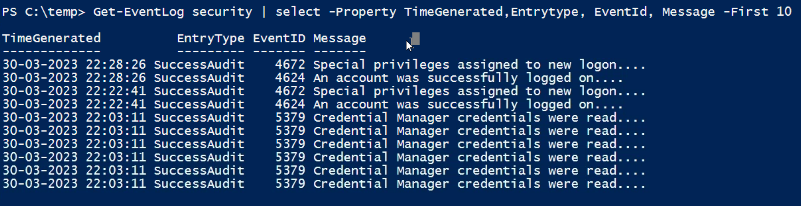

### Exercise scenario 1 Answers

1. Show the list of top 10 security eventlogs showing the properties like Time, Entry Type ,Event ID and Message

2. Show the list of top 10 process that are consuming more cpu arranged in descending order by thier name. 

3. Show the list of unique Process Names running on your System

## Excercise Scenario 2 Answers

1. Get the count of eventslogs present in Application eventlog, printing only the property count. 

2. Get the total number of process that are running under the name svchost and calculate the Total Physical Memory used by these processes, including the avg memory , Minimum and the Maximum. 

3. Get all the unique Events Ids from the top 200 new events generated in Application EVentlog and sort by source in ascending order

